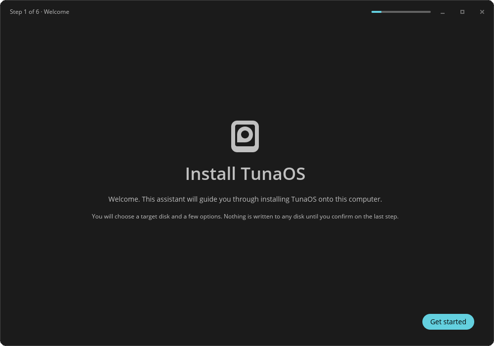

# TunaOS COSMIC Installer — libcosmic frontend for fisherman

<p align="center">
  
</p>

<p align="center">
  <em>Every frame is rendered in CI from the real libcosmic app — see the
  <a href="docs/gui-walkthrough.md">step-by-step walkthrough</a>.</em>
</p>

A real **COSMIC** application: `cosmic::Application`, the COSMIC header bar,
the cosmic widget set and the `cosmic-theme` palette. It drives the
[fisherman](https://github.com/projectbluefin/fisherman) bootc install backend.

> Previously this crate was plain `iced` with `.theme(|_| Theme::Dark)`
> hardcoded and no `libcosmic` dependency at all, which is why it never looked
> like a COSMIC app — the styling was not "missing", it was never wired up. It
> also did not compile: the source targeted the iced 0.13 API while
> `Cargo.toml` asked for 0.14, and no CI job ever ran `cargo build`.

## Workflow

1. **Welcome** — brief intro
2. **Select a disk** — `lsblk -J` lists available disks; user picks one
3. **Options** — computer name, filesystem, encryption
4. **Confirm** — summary of choices, under a warning banner
5. **Installing** — writes recipe JSON, runs `fisherman`, streams output
6. **Finished** — success/failure

## Build

```bash
# libcosmic needs these headers even when it will run under X11.
sudo apt-get install -y pkg-config cmake clang \
  libwayland-dev libxkbcommon-dev libfontconfig-dev libfreetype-dev \
  libinput-dev libudev-dev libgbm-dev libegl1-mesa-dev libssl-dev

cargo build --release
cargo run --release
```

## Recipe

Produces the same JSON recipe as the Qt/KDE installer.

## License

GPL-3.0-only

## Flatpak

```bash
# One-time: generate offline cargo sources for flatpak-builder
pip install aiohttp toml && python3 flatpak-cargo-generator.py Cargo.lock -o flatpak/cargo-sources.json

flatpak-builder --user --install --force-clean build flatpak/org.tunaos.InstallerCosmic.json
flatpak run org.tunaos.InstallerCosmic
```

`flatpak-cargo-generator.py` comes from
https://github.com/flatpak/flatpak-builder-tools/tree/master/cargo

## Offline installs

On a TunaOS live ISO the installer detects the booted bootc image
(`bootc status`) and installs it without a download (empty `image` in the
recipe). Embedded OCI stores listed in `/etc/tuna-installer/offline-stores`
(or `$TUNA_OFFLINE_STORES`, default `/usr/share/tuna-installer/oci-store`)
are passed to fisherman as `additionalImageStores`.

## Screenshots

`docs/screenshots/` is regenerated by `.github/workflows/screenshots.yml` from
the real UI, and uploaded as an artifact on every PR that touches `src/`
— including when the capture fails, which is when the picture is most needed.

Locally:

```bash
sudo apt-get install -y mesa-vulkan-drivers xvfb imagemagick
just capture
```

Capture mode is entered only by setting `TUNA_CAPTURE_DIR`. In that mode the
app uses fixture disks, never shells out to `lsblk`/`bootc`/`podman`, and
refuses `StartInstall` outright — driving the wizard to the install screen
cannot start an install. The harness reads back the frame wgpu actually
presented and fails if any screen did not really render.
