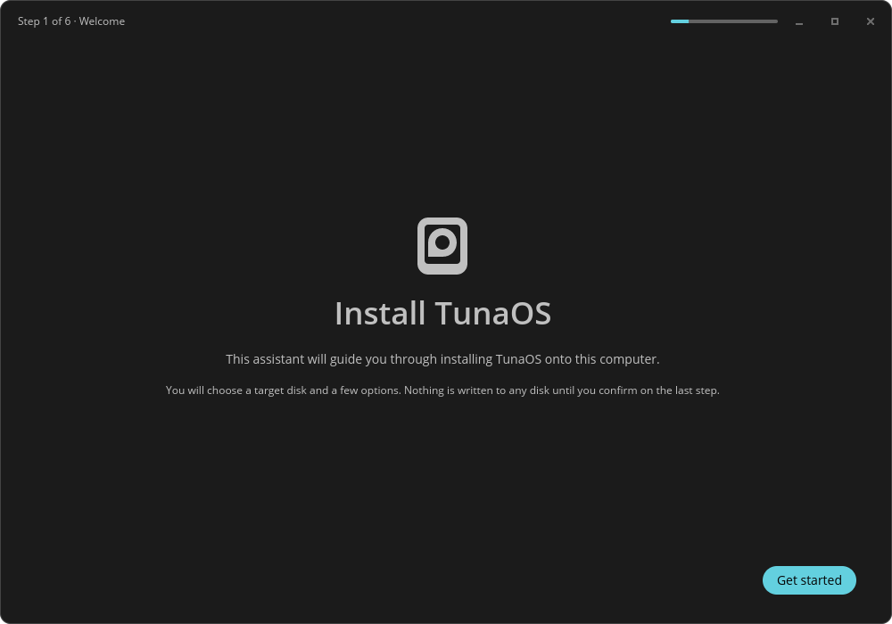
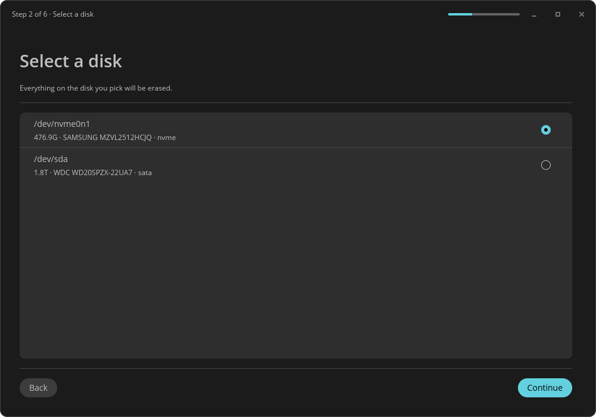
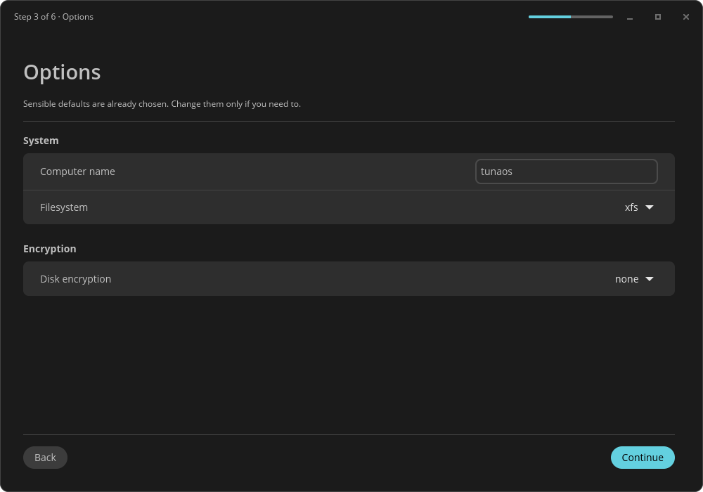
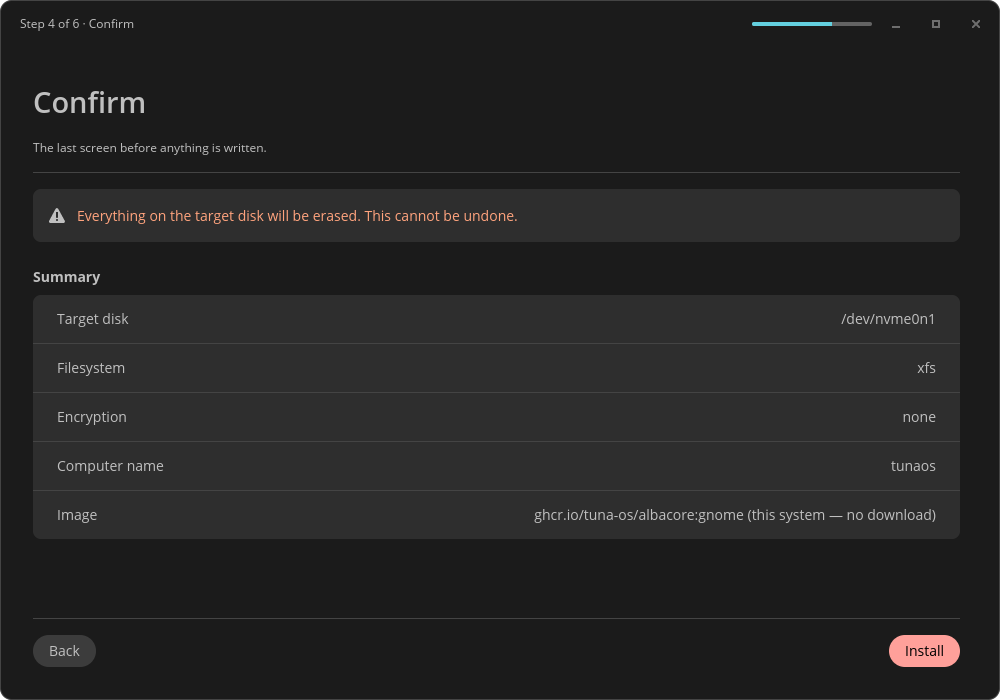
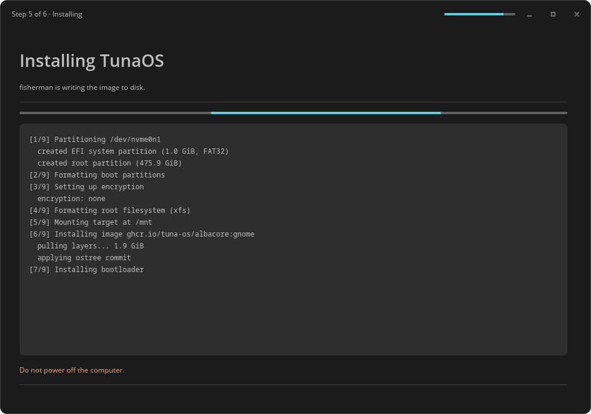
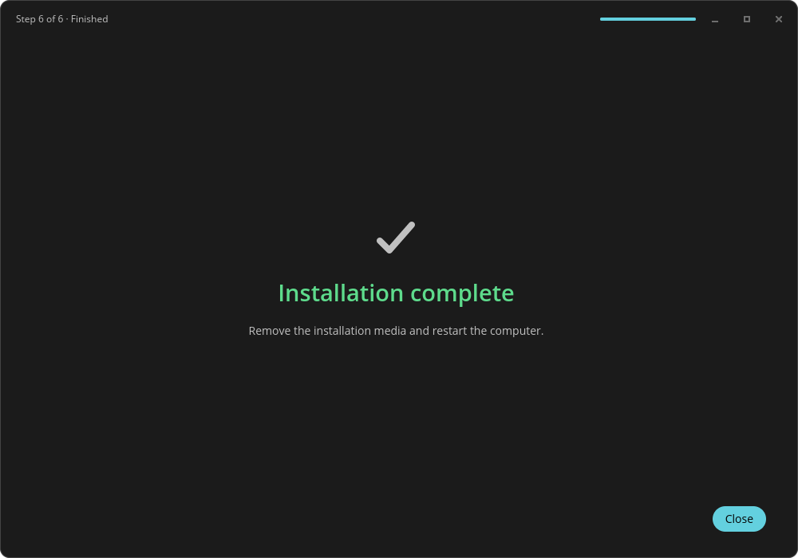

# Installing TunaOS with the COSMIC installer — a walkthrough

This is what the installer looks like, screen by screen. Every image on this
page is generated in CI from the real libcosmic application by the capture mode
built into the binary (`TUNA_CAPTURE_DIR=... tuna-installer-cosmic`), so it
cannot drift from the app the way hand-taken screenshots do.

The capture runs headless with no desktop, no GPU and no real disks: Xvfb for a
display, Mesa's **lavapipe** for a software Vulkan adapter so wgpu has
something to render on, and fixture data in place of every hardware query. It
never touches a disk.

---

## 1. Welcome



The COSMIC header bar carries the step counter and a progress bar for the whole
wizard, so the chrome does the navigation reporting instead of the page body.
Nothing is written to any disk until you confirm on the last step.

## 2. Select a disk



Disks come from `lsblk -J`. Each row is a COSMIC list item with the device
node, its size, model and bus. **Continue** stays unavailable until something
is selected, so there is no way to walk past this screen without a target.

## 3. Options



COSMIC settings sections: computer name, filesystem, and encryption. The
defaults are already right for nearly everyone. The passphrase field does not
exist at all until you pick an encryption mode that needs one — the KDE sibling
crashed on exactly this relationship by wiring the toggle up before the
passphrase widgets existed.

## 4. Confirm



The summary of everything chosen, under a COSMIC warning banner. This is the
last screen before anything is written, and the only one whose action button is
styled destructive rather than suggested. Everything above this point is
reversible by quitting.

## 5. Installing



`fisherman` runs with the recipe JSON written 0600 under `XDG_RUNTIME_DIR`
(it may hold a passphrase), and its output streams into the log card.

The log shown here is fixture text. The capture harness sets this page
directly and never sends `StartInstall`; the message handler additionally
refuses `StartInstall` outright whenever capture mode is on. That interlock is
not decorative — in `tuna-installer-xfce` the page-enter hook called
`start_install()`, so a capture written the obvious way would have partitioned
the CI runner's disk.

## 6. Finished



Success or failure, coloured from the COSMIC theme's `success_text_color` /
`destructive_text_color` rather than hardcoded RGB. Remove the installation
media and restart into the new system.

---

## Regenerating these

```bash
sudo apt-get install -y mesa-vulkan-drivers xvfb imagemagick
just capture
```

The capture reads its own pixels back — it pulls the frame wgpu actually
presented via `iced::window::screenshot` and measures colour count, the share
of the frame taken by a single flat colour, and the share that is "ink". A page
that failed to render is a valid, non-empty PNG of nothing, so file existence
proves nothing; `bootc-installer-asahi` shipped a blank settings page behind
exactly that check. The thresholds are calibrated against measured output from
real renders and every run prints its numbers.

## What the first capture run caught

Two defects that no diff would have shown, found the first time these images
were rendered:

* **No icons at all.** Every `icon::from_name(...)` silently drew nothing,
  including the dropdown chevrons on the Options page and the window controls
  in the header bar — the controls were simply absent. libcosmic resolves icons
  through the freedesktop icon theme, and nothing had named one. Fixed by
  setting `default_icon_theme("Adwaita")`.
* **An unreadable warning banner.** `widget::warning::warning` on the Confirm
  page drew near-white body text on a light amber fill: legible in the light
  COSMIC theme, effectively invisible in the dark one. Replaced with a card and
  warning-coloured text.

Both were live in the code and both are exactly the class of problem this job
exists to surface.
